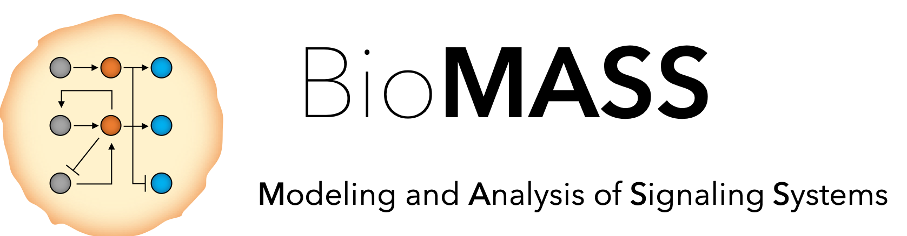
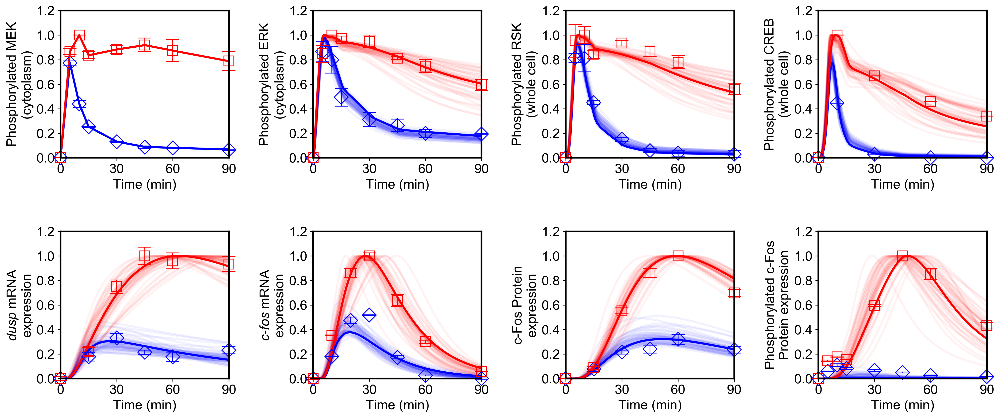
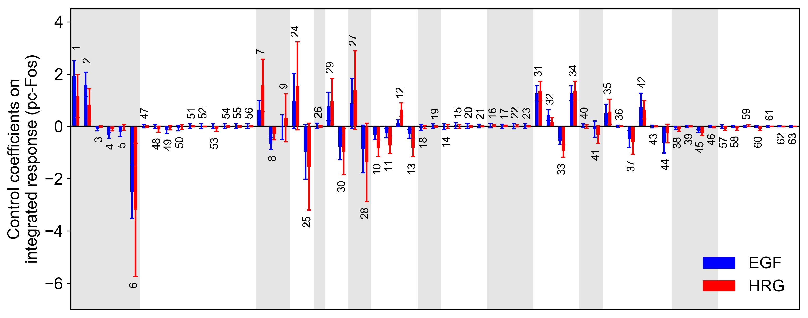

# BioMASS


当ソフトウェアは，細胞内シグナル伝達機構の数理モデリングを目的としたツールです．実験から得られた実測データに基づいてモデル内のパラメータを最適化し，その結果に基づいた解析により，細胞応答に対する反応ネットワーク内の重要な要素を同定することができます．

ここでは，早期転写の反応ネットワーク ([Nakakuki *et al.*, ***Cell***, 2010](https://doi.org/10.1016/j.cell.2010.03.054)) を例に使用しています.


## 使い方

#### モデルの読み込み
```python
from biomass.models import Nakakuki_Cell_2010
```

#### ODEモデルのパラメータ推定 (n = 1, 2, 3, · · ·)
パラメータ最適化には遺伝的アルゴリズムを用いています．世代交代毎に，最良のパラメータセットが```out/n/```に保存されます．
```python
from biomass import optimize

optimize(Nakakuki_Cell_2010, n)
```
進捗は```out/n/optimization.log```で見ることができます．
```
Generation1: Best Fitness = 1.726069e+00
Generation2: Best Fitness = 1.726069e+00
Generation3: Best Fitness = 1.726069e+00
Generation4: Best Fitness = 1.645414e+00
Generation5: Best Fitness = 1.645414e+00
Generation6: Best Fitness = 1.645414e+00
Generation7: Best Fitness = 1.645414e+00
Generation8: Best Fitness = 1.645414e+00
Generation9: Best Fitness = 1.645414e+00
Generation10: Best Fitness = 1.645414e+00
Generation11: Best Fitness = 1.645414e+00
Generation12: Best Fitness = 1.645414e+00
Generation13: Best Fitness = 1.645414e+00
Generation14: Best Fitness = 1.645414e+00
Generation15: Best Fitness = 1.645414e+00
Generation16: Best Fitness = 1.249036e+00
Generation17: Best Fitness = 1.171606e+00
Generation18: Best Fitness = 1.171606e+00
Generation19: Best Fitness = 1.171606e+00
Generation20: Best Fitness = 1.171606e+00
```

- 途中で中断したところから再開したい場合，
```python
from biomass import optimize_continue

optimize_continue(Nakakuki_Cell_2010, n)
```
- 複数のパラメータセット（*n1*から*n2*）を同時に探索したい場合,
```python
from biomass import optimize

optimize(Nakakuki_Cell_2010, n1, n2)
```

---
#### シミュレーション結果の可視化
パラメータ推定で得た複数のパラメータセットでのシミュレーション結果を出力します．結果は```figure/```に保存されます．
```python
from biomass import run_simulation

run_simulation(Nakakuki_Cell_2010, viz_type='average', show_all=False, stdev=True)
```

コマンドライン引数を設定することで，出力されるグラフの表示法を変更することができます．

**viz_type** : str
- ```'average'``` : ```out/```にある複数のパラメータセットでのシミュレーション結果の平均を表示します．

- ```'best'``` : ```out/```にある複数のパラメータセットでのシミュレーション結果のうち，最良のものを表示します．

- ```'original'``` : ```set_model.py```に記述されているパラメータ，初期値を使用したシミュレーション結果を表示します．

- ```'n(=1,2,...)'``` : ```out/n(=1,2,...)``` における最新のパラメータセットでのシミュレーション結果を表示します．

- ```'experiment'``` : ```observable.py``` に記述されている実験値の結果のみを表示します．

**show_all** : bool
- ```out/n(=1,2,...)```に格納されたパラメータセットでの全てのシミュレーション結果を表示します．

**stdev** : bool
- ```viz_type == 'average'```の際，標準偏差も含めて表示します．



点（青, EGF; 赤, HRG）は実験データ，線はシミュレーション結果を表す

---
#### 感度解析
```python
from biomass import run_analysis

run_analysis(Nakakuki_Cell_2010, target='reaction', metric='integral', style='barplot')
```

感度係数は以下の式で記述されます．

*s<sub>i</sub>*(*q*(**v**),*v<sub>i</sub>*) = *∂* ln(*q*(**v**)) / *∂* ln(*v<sub>i</sub>*) = *∂*_q_(**v**) / *∂*_v<sub>i</sub>_ · *v<sub>i</sub>* / *q*(**v**)

ここで *v<sub>i</sub>* は*i*番目の反応速度を表し, **v** は反応速度のベクトル **v** = (*v<sub>1</sub>*, *v<sub>2</sub>*, ...)，*q*(**v**) は出力を定量する関数です（例：応答の積分値，最大値，持続時間など）． 感度係数は微分を1%の反応速度の変化で有限差分近似して計算されます．

各反応における感度係数を求めるためには，[```model/set_model.py```](biomass/model/set_model.py)中で，反応速度を 'v' で表す場合，全ての反応式を記述した直後に，以下を書いておく必要があります．
```python
if self.perturbation:
    for i, dv in self.perturbation.items():
        v[i] = v[i] * dv
```
**target** : 何に対する感度解析かを選択します（反応速度・初期値・パラメータ）.
- ```'reaction'```
- ```'initial_condition'```
- ```'parameter'```

**metric** : 出力に用いる基準を設定します．
- ```'maximum'```
    : 最大値．
- ```'minimum'```
    : 最小値．
- ```'duration'```
    : 最大値の10%まで減少するまでにかかる時間．
- ```'integral'```
    : シミュレーション時間内における濃度の積分値．

**style** : グラフを選択します．
- ```'barplot'```
- ```'heatmap'```



pc-Fosの積分値に対する感度係数（青, EGF; 赤, HRG）．棒の上下の数字は反応番号を，エラーバーは標準偏差を表す．

## フィードバックのお願い
ソフトウェアの継続的改善のため，使用感の報告やバグレポート，アドバイスをいただきたいと考えております．また，お手持ちの実験データの背後に潜む制御メカニズムを数理モデルを用いて明らかにしたいというご要望も承りますので，どうぞお気軽にご相談ください．

## 免責事項
当ソフトウェアの出力結果の正確性や妥当性につきまして，一切の保障はいたしません．また当ソフトウェアを用いることで生じたあらゆる損害について，一切の責任を負いません．

## 参考文献
- Nakakuki, T. *et al.* Ligand-specific c-Fos expression emerges from the spatiotemporal control of ErbB network dynamics. *Cell* **141**, 884–896 (2010). https://doi.org/10.1016/j.cell.2010.03.054

- Kimura, S., Ono, I., Kita, H. & Kobayashi, S. An extension of UNDX based on guidelines for designing crossover operators: proposition and evaluation of ENDX. *Trans. Soc. Instrum. Control Eng.* **36**, 1162–1171 (2000). https://doi.org/10.9746/sicetr1965.36.1162

- Kimura, S. & Konagaya, A. A Genetic Algorithm with Distance Independent Diversity Control for High Dimensional Function Optimization. *J. Japanese Soc. Artif. Intell.* **18**, 193–202 (2003). https://doi.org/10.1527/tjsai.18.193

- Kimura, S., Nakakuki, T., Kirita, S. & Okada, M. AGLSDC: A Genetic Local Search Suitable for Parallel Computation. *SICE J. Control. Meas. Syst. Integr.* **4**, 105–113 (2012). https://doi.org/10.9746/jcmsi.4.105

- Kholodenko, B. N., Demin, O. V. & Westerhoff, H. V. Control Analysis of Periodic Phenomena in Biological Systems. *J. Phys. Chem. B* **101**, 2070–2081 (1997). https://doi.org/10.1021/jp962336u

- Kholodenko, B. N., Hoek, J. B., Westerhoff, H. V. & Brown, G. C. Quantification of information transfer via cellular signal transduction pathways. *FEBS Lett.* **414**, 430–434 (1997). https://doi.org/10.1016/S0014-5793(97)01018-1

## ライセンス
[MIT](LICENSE)
