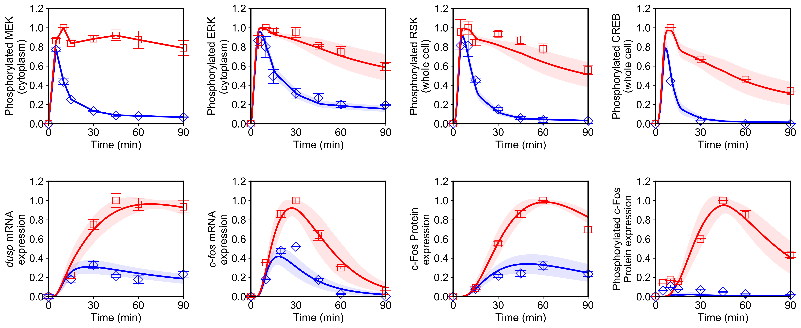

# BioMASS
## Modeling and Analysis of Signaling Systems

Mathematical modeling is a powerful method for the analysis of complex biological systems. Although there are many researches devoted on producing models to describe dynamical cellular signaling systems, most of these models are limited and do not cover multiple pathways. Therefore, there is a challenge to combine these models to enable understanding at a larger scale. Nevertheless, larger network means that it gets more difficult to estimate parameters to reproduce dynamic experimental data needed for deeper understanding of a system.<br>
To overcome this problem, we developed BioMASS, a modeling platform tailored to optimizing mathematical models of biological processes. By using BioMASS, users can efficiently optimize kinetic parameters to fit user-defined models to experimental data, while performing analysis on reaction networks to predict critical components affecting cellular output.

## Description
BioMASS is a biological modeling environment tailored to

1. Parameter Estimation of ODE Models
1. Sensitivity Analysis

currently implimented for modeling early transcriptional regulation pathway ([Nakakuki *et al.*, ***Cell***, 2010](https://doi.org/10.1016/j.cell.2010.03.054)).

## Dependencies
> - numpy
> - scipy
> - matplotlib
> - seaborn

## Usage
#### Parameter Estimation of ODE Models (*n* = 1, 2, 3, · · ·)
The temporary result will be saved in ```out/n/``` after each iteration.
```bash
$ nohup python optimize.py n &
```
Progress list: ```out/n/out.log```
```
Generation1: Best Fitness = 1.726069e+00
Generation2: Best Fitness = 1.726069e+00
Generation3: Best Fitness = 1.726069e+00
Generation4: Best Fitness = 1.645414e+00
Generation5: Best Fitness = 1.645414e+00
Generation6: Best Fitness = 1.645414e+00
Generation7: Best Fitness = 1.645414e+00
Generation8: Best Fitness = 1.645414e+00
Generation9: Best Fitness = 1.645414e+00
Generation10: Best Fitness = 1.645414e+00
Generation11: Best Fitness = 1.645414e+00
Generation12: Best Fitness = 1.645414e+00
Generation13: Best Fitness = 1.645414e+00
Generation14: Best Fitness = 1.645414e+00
Generation15: Best Fitness = 1.645414e+00
Generation16: Best Fitness = 1.249036e+00
Generation17: Best Fitness = 1.171606e+00
Generation18: Best Fitness = 1.171606e+00
Generation19: Best Fitness = 1.171606e+00
Generation20: Best Fitness = 1.171606e+00
```

- If you want to continue from where you stopped in the last parameter search,
```bash
$ nohup python optimize_continue.py n &
```
- If you want to search multiple parameter sets (from *n1* to *n2*) simutaneously,
```bash
$ nohup python optimize.py n1 n2 &
```

---
#### Visualization of Simulation Results
```bash
$ python run_sim.py
```
```viz_type```:

- 'average'
    : The average of simulation results with parameter sets in ```out/```

- 'best'
    : The best simulation result in ```out/```, simulation with ```best_fit_param```

- 'original'
    : Simulation with the default parameters and initial values defined in ```biomass/model/```

- 'n(=1,2,...)'
    : Use the parameter set in ```out/n/```

```python
simulate_all(viz_type='average',show_all=False,stdev=True)
```


```python
simulate_all(viz_type='best',show_all=True,stdev=False)
```


Points (blue diamonds, EGF; red squares, HRG) denote experimental data, solid lines denote simulations

---
#### Sensitivity Analysis
The single parameter sensitivity of each reaction is defined by<br>

*s<sub>i</sub>*(*q*(**v**),*v<sub>i</sub>*) = *∂* ln(*q*(**v**)) / *∂* ln(*v<sub>i</sub>*) = *∂*_q_(**v**) / *∂*_v<sub>i</sub>_ · *v<sub>i</sub>* / *q*(**v**)

where *v<sub>i</sub>* is the *i*<sup>th</sup> reaction rate, **v** is reaction vector **v** = (*v<sub>1</sub>*, *v<sub>2</sub>*, ...) and *q*(**v**) is a target function, e.g., time-integrated response, duration. Sensitivity coefficients were calculated using finite difference approximations with 1% changes in the reaction rates.

```bash
$ python analyze.py
```
```metric```:
- 'duration'
    : The time it takes to decline below 10% of its maximum.
- 'integral'
    : The integral of concentration over the observation time.
```python
reaction.sensitivity_barplot(metric='integral')
```


Control coefficients for integrated pc-Fos are shown by bars (blue, EGF; red, HRG). Numbers above bars indicate the reaction indices, and error bars correspond to simulation standard deviation.

## Optimization algorithm
[`biomass/param_estim/ga`](biomass/param_estim/ga)
#### ga_v1:
Parameter values are searched by genetic algorithm with Unimodal Normal Distribution Crossover (UNDX) and Minimal Generation Gap (MGG).

#### ga_v2:
ga_v2 optimizes an objective function through the following procedure.

1. **Initialization**<br>
As an initial population, create *n*<sub>*p*</sub> individuals randomly. ga_v2 also represents individuals as *n*-dimensional real number vectors, where *n* is the dimension of the search space. Set Generation to 0, and set the iteration number of converging operations *N<sub>iter</sub>* to 1.

1. **Selection for reproduction**<br>
As parents for the recombination operator, ENDX, select *m* individuals, **p**<sub>1</sub>, **p**<sub>2</sub>, · · · ,**p**<sub>*m*</sub>, without replacement from the population.

1. **Generation of offsprings**<br>
Generate *N<sub>*c*</sub>* children by applying ENDX to the selected parents. This algorithm assigns the worst objective value to the children.

1. **Local Search (NDM/MGG)**<br>
Apply the local search method to the best individual in a family consisting of the two parents, i.e., **p**<sub>1</sub> and **p**<sub>2</sub>, and their children. Note here that the children are assumed to have the worst objective value. Thus, whenever the objective values of the two parents have been actually computed in previous generations, the algorithm applies the local search to either of the parents. When all of the individuals in the family have the same objective value, on the other hand, the local search is applied to a randomly selected individual from the family.

1. **Selection for survival**<br>
Select two individuals from the family. The first selected individual should be the individual with the best objective value, and the second should be selected randomly. Then, replace the two parents (**p**<sub>1</sub> and **p**<sub>2</sub>) with the selected individuals. Note that the individual to which the local search has been applied in the previous step is always selected as the best.

1. **Application of ENDX/MGG**<br>
To achieve a good search performance, ga_v2 optimizes a function, gradually narrowing the search space. For this purpose, the converging phase slightly converges the population by repeating the following procedure *N<sub>iter</sub>* times.
    1. Select *m* individuals without replacement from the population. The selected individuals, expressed here as **p**<sub>1</sub>, **p**<sub>2</sub>, · · · , **p**<sub>*m*</sub>, are used as the parents for an extended normal distribution crossover (ENDX) applied in the next step.

    1. Generate *N<sub>*c*</sub>* children by applying ENDX to the parents selected in the previous step. To reduce the computational cost, ga_v2 forgoes any computation of the objective values of the *N<sub>*c*</sub>* individuals generated here. Instead, the algorithm assigns the newly generated children a single objective value, one which is inferior to the objective values of any of the possible candidate solutions.

    1. Select two individuals from a family containing the two parents, i.e., **p**<sub>1</sub> and **p**<sub>2</sub>, and their children. The first selected individual should be the one with the best objective value, and the second should be selected randomly. Then, replace the two parents with the selected individuals.

1. **Adaptation of *N<sub>iter</sub>***<br>
If the best individual has not improved during the last *n*<sub>*p*</sub> generations, *N<sub>iter</sub>* ← 2 × *N<sub>iter</sub>*. Otherwise, set *N<sub>iter</sub>* to 1.

1. **Termination**<br>
Stop if the halting criteria are satisfied. Otherwise, *Generation* ← *Generation* +1, and return to the step 2.

## Installation
    $ git clone https://github.com/okadalabipr/biomass.git

## References
- Nakakuki, T. *et al.* Ligand-specific c-Fos expression emerges from the spatiotemporal control of ErbB network dynamics. *Cell* **141**, 884–896 (2010). https://doi.org/10.1016/j.cell.2010.03.054

- Kimura, S., Ono, I., Kita, H. & Kobayashi, S. An extension of UNDX based on guidelines for designing crossover operators: proposition and evaluation of ENDX. *Trans. Soc. Instrum. Control Eng.* **36**, 1162–1171 (2000). https://doi.org/10.9746/sicetr1965.36.1162

- Kimura, S. & Konagaya, A. A Genetic Algorithm with Distance Independent Diversity Control for High Dimensional Function Optimization. *J. Japanese Soc. Artif. Intell.* **18**, 193–202 (2003). https://doi.org/10.1527/tjsai.18.193

- Kimura, S., Nakakuki, T., Kirita, S. & Okada, M. AGLSDC: A Genetic Local Search Suitable for Parallel Computation. *SICE J. Control. Meas. Syst. Integr.* **4**, 105–113 (2012). https://doi.org/10.9746/jcmsi.4.105

- Kholodenko, B. N., Demin, O. V. & Westerhoff, H. V. Control Analysis of Periodic Phenomena in Biological Systems. *J. Phys. Chem. B* **101**, 2070–2081 (1997). https://doi.org/10.1021/jp962336u

- Kholodenko, B. N., Hoek, J. B., Westerhoff, H. V. & Brown, G. C. Quantification of information transfer via cellular signal transduction pathways. *FEBS Lett.* **414**, 430–434 (1997). https://doi.org/10.1016/S0014-5793(97)01018-1

## License
[MIT](/LICENSE)