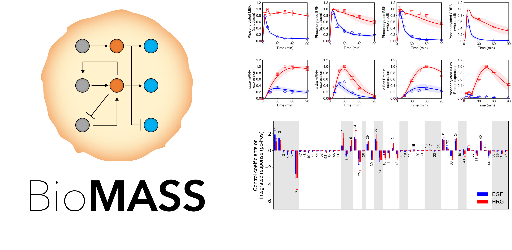

# BioMASS
## Modeling and Analysis of Signaling Systems


## Description
BioMASS is a biological modeling environment tailored to

1. Parameter Estimation of ODE Models
1. Sensitivity Analysis

currently implimented for modeling early transcriptional regulation pathway ([Nakakuki *et al., Cell*, 2010](https://doi.org/10.1016/j.cell.2010.03.054)).

## Dependencies
- Python 3+
- numpy, scipy, matplotlib, seaborn

## Usage
#### Parameter Estimation of ODE Models (*n* = 1, 2, 3, · · ·)
```bash 
$ nohup python run_ga.py n &
``` 
- If you want to continue from where you stopped in the last parameter search,
```bash 
$ nohup python run_ga_continue.py n &
``` 
---
#### Visualization of Simulation Results
```bash
$ python run_sim.py
```
---
#### Sensitivity Analysis
```bash
$ python run_analysis.py
```

## Installation
    $ git clone https://github.com/okadalabipr/biomass.git

## References
- Nakakuki, T. *et al.* Ligand-specific c-Fos expression emerges from the spatiotemporal control of ErbB network dynamics. *Cell* **141**, 884–896 (2010). https://doi.org/10.1016/j.cell.2010.03.054

- Kimura, S., Ono, I., Kita, H. & Kobayashi, S. An extension of UNDX based on guidelines for designing crossover operators: proposition and evaluation of ENDX. *Trans. Soc. Instrum. Control Eng.* **36**, 1162–1171 (2000). https://doi.org/10.9746/sicetr1965.36.1162

- Kimura, S. & Konagaya, A. A Genetic Algorithm with Distance Independent Diversity Control for High Dimensional Function Optimization. *J. Japanese Soc. Artif. Intell.* **18**, 193–202 (2003). https://doi.org/10.1527/tjsai.18.193

- Kimura, S., Nakakuki, T., Kirita, S. & Okada, M. AGLSDC: A Genetic Local Search Suitable for Parallel Computation. *SICE J. Control. Meas. Syst. Integr.* **4**, 105–113 (2012). https://doi.org/10.9746/jcmsi.4.105

- Kholodenko, B. N., Demin, O. V. & Westerhoff, H. V. Control Analysis of Periodic Phenomena in Biological Systems. *J. Phys. Chem. B* **101**, 2070–2081 (1997). https://doi.org/10.1021/jp962336u

- Kholodenko, B. N., Hoek, J. B., Westerhoff, H. V. & Brown, G. C. Quantification of information transfer via cellular signal transduction pathways. *FEBS Lett.* **414**, 430–434 (1997). https://doi.org/10.1016/S0014-5793(97)01018-1

## License
[MIT](/LICENSE)