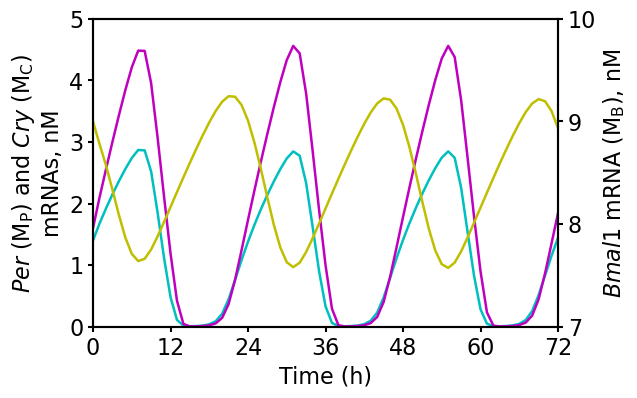

# Leloup_PNAS_2003

## Computational Model for the Mammalian Circadian Clock

Leloup, J.-C. & Goldbeter, A. Toward a detailed computational model for the mammalian circadian clock. _Proc. Natl. Acad. Sci._ **100**, 7051–6 (2003). https://doi.org/10.1073/pnas.1132112100

## BioModels

- [Leloup2003_CircClock_DD](https://www.ebi.ac.uk/biomodels/BIOMD0000000073)

## Run simulation using BioMASS

1. Clone this repository and `cd` into it

    ```
    $ git clone https://github.com/biomass-dev/biomass.git
    $ cd biomass
    ```

1. Save simulation results

    ```python
    import os

    import numpy as np
    import matplotlib.pyplot as plt
    from biomass.models import circadian_clock
    from biomass import Model, run_simulation

    model = Model(circadian_clock.__package__).create()

    def save_result(model):

        run_simulation(model, viz_type="original")
        res = np.load(os.path.join(model.path, "simulation_data", "simulations_original.npy"))

        plt.rcParams['font.size'] = 16
        fig, ax1 = plt.subplots(figsize=(6, 4))
        ax2 = ax1.twinx()

        ax1.plot(model.problem.t, res[model.observables.index('Cry_mRNA'), 0], 'c')
        ax1.plot(model.problem.t, res[model.observables.index('Per_mRNA'), 0], 'm')
        ax1.set_xlim([0, 72])
        ax1.set_xticks([0, 12, 24, 36, 48, 60, 72])
        ax1.set_xlabel('Time (h)')
        ax1.set_ylim([0, 5])
        ax1.set_ylabel(
            r'$\it{Per}$'+' '+r'$\sf{(M_P)}$'+' and '+
            r'$\it{Cry}$'+' '+r'$\sf{(M_C)}$'+'\nmRNAs, nM'
        )
        ax2.plot(model.problem.t, res[model.observables.index('Bmal1_mRNA'), 0], 'y')
        ax2.set_ylim([7, 10])
        ax2.set_yticks([7, 8, 9, 10])
        ax2.set_ylabel(r'$\it{Bmal1}$'+' mRNA '+r'$\sf{(M_B)}$'+', nM')
        plt.savefig(f"{os.path.basename(model.path)}", bbox_inches="tight")

    save_result(model)
    ```

    
