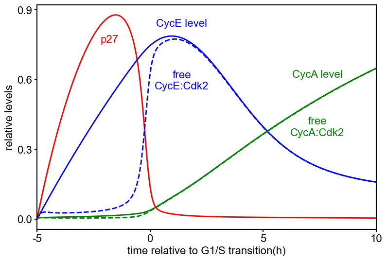

# Barr_CellSyst_2016

## Mathematical model of the G1/S transition

Barr, A. R., Heldt, F. S., Zhang, T., Bakal, C. & Novák, B. A Dynamical Framework for the All-or-None G1/S Transition. *Cell Syst.* **2**, 27–37 (2016). https://doi.org/10.1016/j.cels.2016.01.001

## BioModels

- [Barr2016 - All-or-nothing G1/S transition](https://www.ebi.ac.uk/biomodels/BIOMD0000000646)

## Run simulation using BioMASS

```python
import os

import numpy as np
import matplotlib.pyplot as plt
from biomass import create_model, run_simulation
from biomass.models import copy_to_current

copy_to_current("g1s_transition")
model = create_model("g1s_transition")

def save_result(model):
    run_simulation(model)
    res = np.load(os.path.join(model.path, "simulation_data", "simulations_original.npy"))

    plt.figure(figsize=(9,6))
    plt.rcParams['font.family'] = 'Arial'
    plt.rcParams['font.size'] = 16
    plt.rcParams['axes.linewidth'] = 1.5
    plt.rcParams['lines.linewidth'] = 2
    plt.rcParams['lines.markersize'] = 20

    plt.plot(model.problem.t, res[model.observables.index('p27_tot'), 0],'r-')
    plt.plot(model.problem.t, res[model.observables.index('CycE_tot'), 0],'b-')
    plt.plot(model.problem.t, res[model.observables.index('CycE'), 0],'b--')
    plt.plot(model.problem.t, res[model.observables.index('CycA_tot'), 0],'g-')
    plt.plot(model.problem.t, res[model.observables.index('CycA'), 0],'g--')

    plt.xticks([0,300,600,900],[-5,0,5,10])
    plt.xlim([0,900])
    plt.xlabel('time relative to G1/S transition(h)')
    plt.yticks([0,0.3,0.6,0.9])
    plt.ylabel('relative levels')

    plt.text(3.2*60,0.75,'p27',ha='center',va='bottom',color='r')
    plt.text(6.4*60,0.82,'CycE level',ha='center',va='bottom',color='b')
    plt.text(6.4*60,0.55,'free\nCycE:Cdk2',ha='center',va='bottom',color='b')
    plt.text(12.4*60,0.6,'CycA level',ha='center',va='bottom',color='g')
    plt.text(12.4*60,0.35,'free\nCycA:Cdk2',ha='center',va='bottom',color='g')

    plt.savefig(f"{os.path.basename(model.path)}", dpi=150, bbox_inches="tight")

save_result(model)
```


