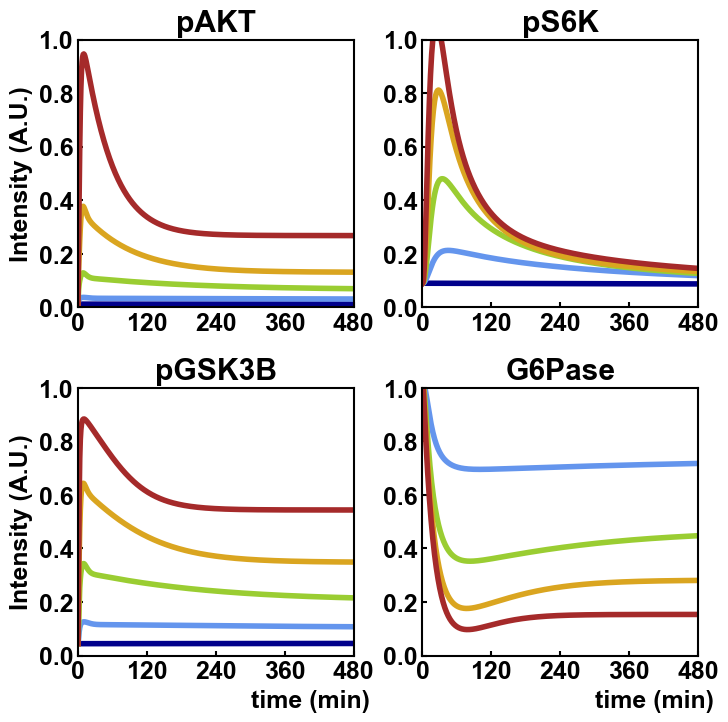

# Kubota_MolCell_2012

## The Insulin-Dependent AKT Pathway Model

Kubota, H. _et al._ Temporal Coding of Insulin Action through Multiplexing of the AKT Pathway. _Mol. Cell_ **46**, 820–832 (2012). https://doi.org/10.1016/j.molcel.2012.04.018

## BioModels

- [Kubota2012_InsulinAction_AKTpathway](https://www.ebi.ac.uk/biomodels/MODEL1204060000)

## Run simulation using BioMASS

```python
import os

import numpy as np
import matplotlib.pyplot as plt
from biomass.models import insulin_signaling
from biomass import Model, run_simulation

model = Model(insulin_signaling.__package__).create()

def save_result(model):

    run_simulation(model)
    res = np.load(os.path.join(model.path, "simulation_data", "simulations_original.npy"))

    plt.figure(figsize=(8, 8))
    plt.rcParams['font.family'] = 'Arial'
    plt.rcParams['xtick.direction'] = 'in'
    plt.rcParams['ytick.direction'] = 'in'
    plt.rcParams['font.size'] = 18
    plt.rcParams['lines.linewidth'] = 4
    plt.rcParams['lines.markersize'] = 16

    plt.subplots_adjust(wspace=0.25, hspace=0.3)

    for i, obs_name in enumerate(model.observables):
        plt.subplot(2, 2, i + 1)
        for j, color in enumerate(['darkblue', 'cornflowerblue', 'yellowgreen', 'goldenrod', 'brown']):
            plt.plot(model.problem.t, res[i, :, j], color=color)
        plt.xlim(0, 480)
        plt.xticks([0, 120, 240, 360, 480], fontweight='bold')
        plt.ylim(0, 1)
        plt.yticks([0, 0.2, 0.4, 0.6, 0.8, 1.0], fontweight='bold')
        plt.title(f'{obs_name}', fontweight='bold')
        if i % 2 == 0:
            plt.ylabel('Intensity (A.U.)', fontweight='bold')
        if i > 1:
            plt.xlabel('                           time (min)', fontweight='bold')
    plt.savefig(f"{os.path.basename(model.path)}", bbox_inches="tight")

save_result(model)
```


