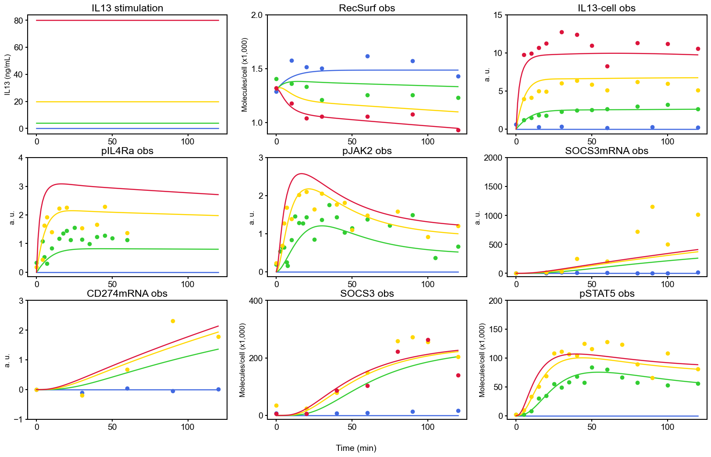

# Raia_CancerRes_2011

This repository contains data and modeling code for the following paper:

Raia, V. _et al._ Dynamic Mathematical Modeling of IL13-Induced Signaling in Hodgkin and Primary Mediastinal B-Cell Lymphoma Allows Prediction of Therapeutic Targets. _Cancer Res._ **71**, 693–704 (2011). <https://doi.org/10.1158/0008-5472.CAN-10-2987>

## BioModels

- [Raia2010 - IL13 Signalling MedB1](https://www.ebi.ac.uk/biomodels/BIOMD0000000313)

## Usage

Run simulation & visualize results:

```python
import os

import matplotlib.pyplot as plt
import numpy as np

from biomass import create_model, run_simulation
from biomass.models import copy_to_current

copy_to_current("jak_stat_pathway")
model = create_model("jak_stat_pathway")
run_simulation(model, viz_type="original")

def save_result(model):
   res = np.load(os.path.join(model.path, "simulation_data", "simulations_original.npy"))
   colors = ["royalblue", "limegreen", "gold", "crimson"]
   ylabels_ticks = [
      ("IL13 (ng/mL)", [0, 20, 40, 60, 80]),
      ("Molecules/cell (x1,000)", [1, 1.5, 2]),
      ("a. u.", [0, 5, 10, 15]),
      ("a. u.", [0, 1, 2, 3, 4]),
      ("a. u.", [0, 1, 2, 3]),
      ("a. u.", [0, 500, 1000, 1500, 2000]),
      ("a. u.", [-1, 0, 1, 2, 3]),
      ("Molecules/cell (x1,000)", [0, 200, 400]),
      ("Molecules/cell (x1,000)", [0, 50, 100, 150, 200]),
   ]

   fig = plt.figure(figsize=(20, 12))
   plt.rcParams["font.family"] = "Arial"
   plt.rcParams["font.size"] = 14

   for i, obs_name in enumerate(model.observables):
      plt.subplot(3, 3, i + 1)
      exp_data = model.problem.experiments[i]
      for j, (color, label) in enumerate(
         zip(colors, model.problem.conditions)
      ):
         plt.plot(model.problem.t, res[i, j], color=color, label=label)
         if obs_name != "IL13_stimulation" and label in exp_data:
               tpoints = model.problem.get_timepoint(obs_name)[label]
               plt.plot(tpoints, exp_data[label], ".", color=color)
      title = obs_name.replace("_", " ") if obs_name == "IL13_stimulation" else obs_name + " obs"
      plt.title(title)
      plt.xticks([0, 50, 100])
      ylabel, yticks = ylabels_ticks[i]
      plt.ylabel(ylabel, fontsize=12)
      plt.yticks(yticks)
   fig.text(0.5, 0.05, "Time (min)", ha="center")
   basename = os.path.basename(model.path)
   plt.savefig(f"{os.path.basename(model.path)}", bbox_inches="tight")

save_result(model)
```


