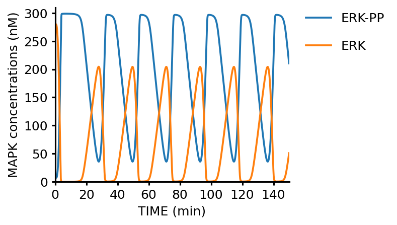

# Kholodenko_EurJBiochem_2000

## The quantitative computational model of the MAPK cascade

Kholodenko, B. N. Negative feedback and ultrasensitivity can bring about oscillations in the mitogen-activted protein kinase cascades. _Eur. J. Biochem_ **267**, 1583–1588 (2000). https://doi.org/10.1046/j.1432-1327.2000.01197.x

## BioModels

- [Kholodenko2000 - Ultrasensitivity and negative feedback bring oscillations in MAPK cascade](https://www.ebi.ac.uk/biomodels/BIOMD0000000010)

## Run simulation using BioMASSS

1. Clone this repository and `cd` into it

    ```
    $ git clone https://github.com/biomass-dev/biomass.git
    $ cd biomass
    ```

1. Save simulation results

    ```python
    import os

    from biomass.models import mapk_cascade
    from biomass import Model, run_simulation

    model = Model(mapk_cascade.__package__).create()

    run_simulation(model)
    ```

    
