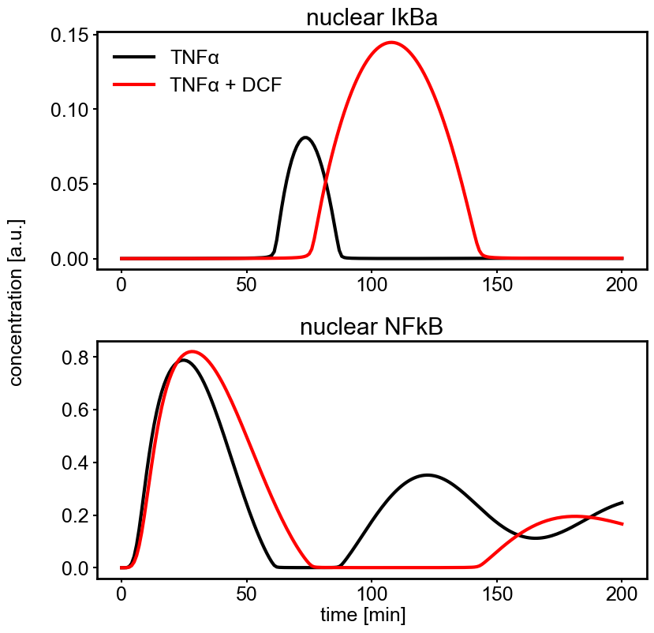

# Oppelt_npjSystBiolAppl_2018

## Dynamic pathway model of TNFα-induced NFκB signal transduction

Oppelt, A. _et al._ Model-based identification of TNFα-induced IKKβ-mediated and IκBα-mediated regulation of NFκB signal transduction as a tool to quantify the impact of drug-induced liver injury compounds. _npj Syst. Biol. Appl._ **4**, 23 (2018). https://doi.org/10.1038/s41540-018-0058-z

## Run simulation using BioMASS

```python
import os

import numpy as np
import matplotlib.pyplot as plt
from biomass.models import nfkb_pathway
from biomass import Model, run_simulation

model = Model(nfkb_pathway.__package__).create()

def save_result(model):

    run_simulation(model, viz_type="original")
    res = np.load(os.path.join(model.path, "simulation_data", "simulations_original.npy"))

    fig=plt.figure(figsize=(9, 9))
    plt.rcParams['font.family'] = 'Arial'
    plt.rcParams['font.size'] = 18
    plt.rcParams['axes.linewidth'] = 2
    plt.rcParams['lines.linewidth'] = 3
    plt.rcParams['lines.markersize'] = 16
    plt.subplots_adjust(wspace=0, hspace=0.3)

    for i, obs_name in enumerate(model.observables):
        plt.subplot(2, 1, i + 1)
        for j, (color, label) in enumerate(zip(['k', 'r'], ['TNFα', 'TNFα + DCF'])):
            plt.plot(model.problem.t, res[i, :, j], color=color, label=label)
        plt.title(f'{obs_name}'.replace('_', ' '))
        plt.xticks([0, 50, 100, 150, 200])
        if i == 0:
            plt.yticks([0, 0.05, 0.10, 0.15])
            plt.legend(loc='upper left', frameon=False)
    fig.text(0.5, 0.05, 'time [min]', ha='center')
    fig.text(0.0, 0.5, 'concentration [a.u.]', va='center', rotation='vertical')
    plt.savefig(f"{os.path.basename(model.path)}", bbox_inches="tight")

save_result(model)
```


