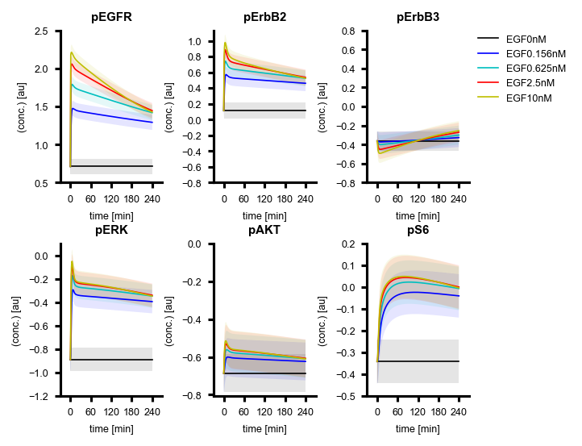

# Hass_npjSysBio_2017

## Multi-pathway computational model

Hass, H., Masson, K., Wohlgemuth, S. *et al.* Predicting ligand-dependent tumors from multi-dimensional signaling features. *npj Syst Biol Appl* **3**, 27 (2017). https://doi.org/10.1038/s41540-017-0030-3

## BioModels

- [Hass2017-PanRTK model for single cell line](https://www.ebi.ac.uk/biomodels/MODEL1708210000)

## Run simulation using BioMASS

```python
import os

import numpy as np
import matplotlib.pyplot as plt
from biomass import create_model, run_simulation
from biomass.models import copy_to_current

copy_to_current("pan_rtk")
model = creaet_model("pan_rtk")

def save_result(model):

    run_simulation(model)
    res = np.load(os.path.join(model.path, "simulation_data", "simulations_original.npy"))

    colors = ['k', 'b', 'c', 'r', 'y']
    yticks = [
        np.arange(0.5, 3, 0.5),
        np.arange(-0.8, 1.2, 0.2),
        np.arange(-0.8, 1, 0.2),
        np.arange(-1.2, 0.2, 0.2),
        np.arange(-0.8, 0.2, 0.2),
        np.arange(-0.5, 0.3, 0.1),
    ]
    sd = 1.0E-1

    plt.rcParams['font.size'] = 6
    plt.rcParams['font.family'] = 'Arial'
    #plt.rcParams['axes.linewidth'] = 1
    plt.rcParams['lines.linewidth'] = 0.8

    plt.subplots_adjust(wspace=0.5, hspace=0.4)

    for i in range(6):
        if i < 3:
            plt.subplot(2, 4, i + 1)
        else:
            plt.subplot(2, 4, i + 2)
        plt.figsize=(7, 4)
        plt.gca().spines['right'].set_visible(False)
        plt.gca().spines['top'].set_visible(False)

        for j, color in enumerate(colors):
            plt.plot(model.problem.t, res[i, j], color, label=model.problem.conditions[j].replace("_", "."))
            plt.fill_between(model.problem.t, res[i, j] - sd, res[i, j] + sd, facecolor=color, lw=0, alpha=0.1)
        plt.title(model.observables[i][:-3], fontweight="bold")
        plt.xlabel('time [min]')
        plt.xticks([0, 60, 120, 180, 240])
        plt.ylabel('(conc.) [au]')
        plt.yticks(yticks[i])
        if i == 2:
            plt.legend(bbox_to_anchor=(1.05, 1), loc='upper left', borderaxespad=0, frameon=False)
    plt.savefig(f"{os.path.basename(model.path)}", dpi=150, bbox_inches="tight")

save_result(model)
```


