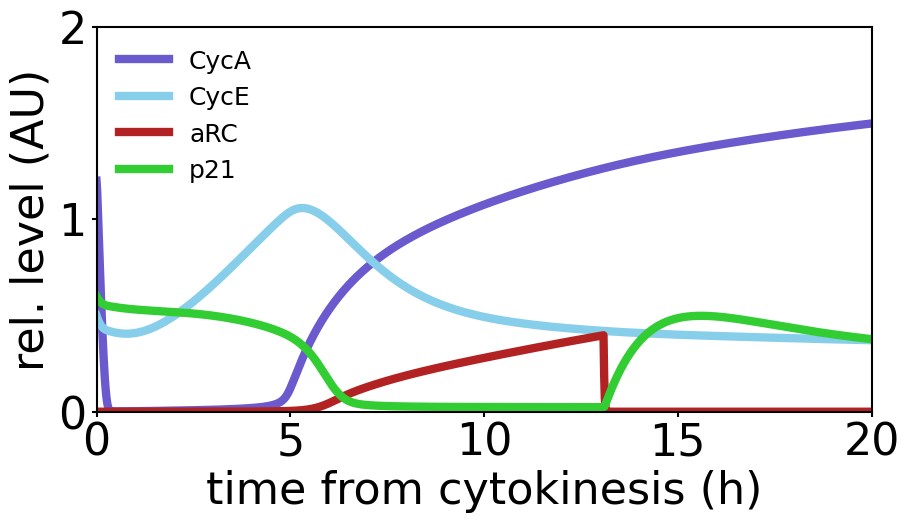

# Heldt_PNAS_2018

## A mechanistic mathematical model to study the proliferation–quiescence decision

Heldt, F. S., Barr, A. R., Cooper, S., Bakal, C. & Novák, B. A comprehensive model for the proliferation–quiescence decision in response to endogenous DNA damage in human cells. *Proc. Natl. Acad. Sci.* **115**, 2532–2537 (2018). https://doi.org/10.1073/pnas.1715345115

## BioModels

- [Heldt2018 - Proliferation-quiescence decision in response to DNA damage](https://www.ebi.ac.uk/biomodels/BIOMD0000000700)

## Run simulation using BioMASS

```python
import os

import numpy as np
import matplotlib.pyplot as plt
from biomass.models import prolif_quies
from biomass import Model, run_simulation

model = Model(prolif_quies.__package__).create()

def save_result(model):
    run_simulation(model)
    res = np.load(os.path.join(model.path, "simulation_data", "simulations_original.npy"))

    plt.figure(figsize=(10,5))
    plt.rcParams['font.size'] = 32
    plt.rcParams['axes.linewidth'] = 1.5
    plt.rcParams['lines.linewidth'] = 6

    plt.plot([t_ / 60 for t_ in model.problem.t], res[model.observables.index('CycA'), 0], color='slateblue', label='CycA')
    plt.plot([t_ / 60 for t_ in model.problem.t], res[model.observables.index('CycE'), 0],color='skyblue', label='CycE')
    plt.plot([t_ / 60 for t_ in model.problem.t], res[model.observables.index('active_RC'), 0], color='firebrick', label='aRC')
    plt.plot([t_ / 60 for t_ in model.problem.t], res[model.observables.index('p21_tot'), 0], color='limegreen', label='p21')

    plt.xlim(0, 20)
    plt.xlabel('time from cytokinesis (h)')
    plt.ylim(0, 2)
    plt.ylabel('rel. level (AU)')
    plt.xticks([0, 5, 10, 15, 20])
    plt.yticks([0, 1, 2])
    plt.legend(loc='upper left', frameon=False, fontsize=18)

    plt.savefig(f"{os.path.basename(model.path)}", dpi=150, bbox_inches="tight")

save_result(model)
```

