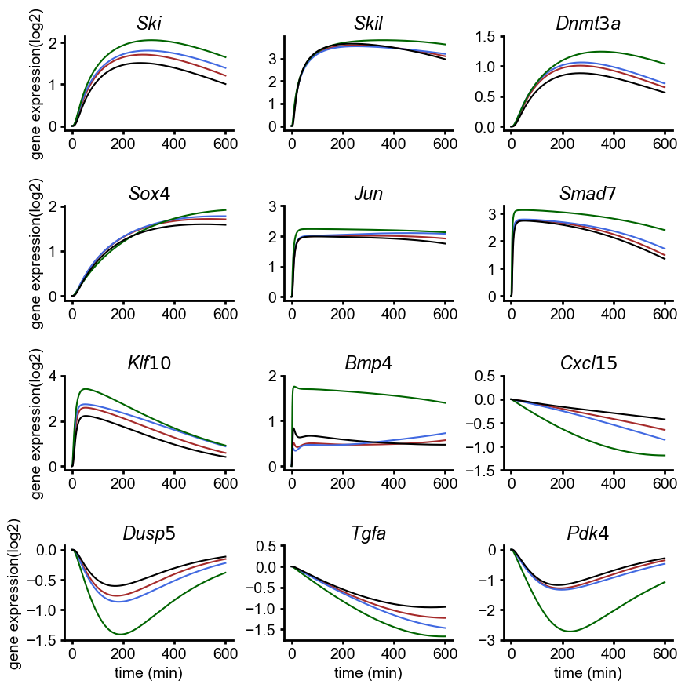

# Lucarelli_CellSyst_2018

## Mathematical modeling of the TGF-β/Smad signaling pathway

Lucarelli, P. _et al._ Resolving the Combinatorial Complexity of Smad Protein Complex Formation and Its Link to Gene Expression. _Cell Syst._ **6**, 75-89.e11 (2018). https://doi.org/10.1016/j.cels.2017.11.010

## Run simulation using BioMASS

```python
import os

import numpy as np
import matplotlib.pyplot as plt
from biomass.models import tgfb_smad
from biomass import Model, run_simulation

model = Model(tgfb_smad.__package__).create()

def save_result(model):

    run_simulation(model)
    res = np.load(os.path.join(model.path, "simulation_data", "simulations_original.npy"))

    plt.figure(figsize=(10, 10))
    plt.rcParams['font.size'] = 14
    plt.rcParams['font.family'] = 'Arial'
    plt.rcParams['mathtext.fontset'] = 'custom'
    plt.rcParams['mathtext.it'] = 'Arial:italic'
    plt.rcParams['axes.linewidth'] = 2
    plt.rcParams['xtick.major.width'] = 2
    plt.rcParams['ytick.major.width'] = 2
    plt.rcParams['lines.linewidth'] = 2
    plt.subplots_adjust(wspace=0.3, hspace=0.8)

    yticks = {
        'Ski': [0, 1, 2],
        'Skil': [0, 1, 2, 3],
        'Dnmt3a': [0, 0.5, 1, 1.5],
        'Sox4': [0, 1, 2],
        'Jun': [0, 1, 2, 3],
        'Smad7': [0, 1, 2, 3],
        'Klf10': [0, 2, 4],
        'Bmp4': [0, 1, 2],
        'Cxcl15': [-1.5, -1, -0.5, 0, 0.5],
        'Dusp5': [-1.5, -1, -0.5, 0],
        'Tgfa': [-1.5, -1, -0.5, 0, 0.5],
        'Pdk4': [-3, -2, -1, 0],
    }

    for i, gene_name in enumerate(model.observables):
        plt.subplot(4, 3, i+1)
        plt.gca().spines['right'].set_visible(False)
        plt.gca().spines['top'].set_visible(False)
        for j, color in enumerate(['brown', 'royalblue', 'darkgreen', 'k']):
            plt.plot(model.problem.t, res[i, :, j], color=color, linewidth=1.5)
            plt.title(fr'$\it{gene_name}$')
            plt.yticks(yticks[gene_name])
        if i >= 9:
            plt.xlabel('time (min)')
        plt.xticks([0, 200, 400, 600])
        if i % 3 == 0:
            plt.ylabel('gene expression(log2)')
    plt.savefig(f"{os.path.basename(model.path)}", bbox_inches="tight")

save_result(model)
```


