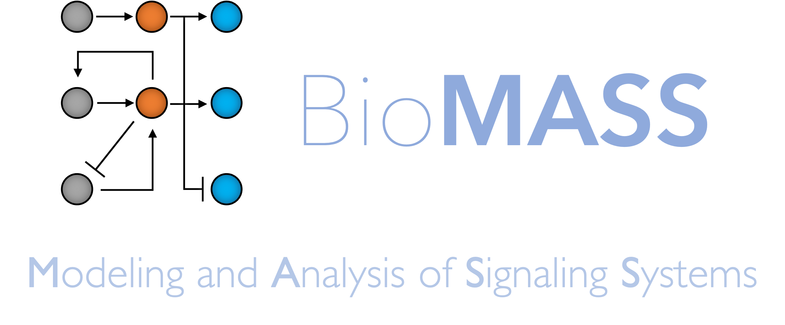

Citing BioMASS
==============

If you use BioMASS in your research, please cite the following paper:

* Arakane, K., Imoto, H., Ormersbach, F. & Okada, M. Extending BioMASS to construct mathematical models from external knowledge. *Bioinformatics Advances* **4**, vbae042 (2024). https://doi.org/10.1093/bioadv/vbae042

*In BibTeX format:*

.. code-block:: bibtex

    @article{10.1093/bioadv/vbae042,
      author  = {Arakane, Kiwamu and Imoto, Hiroaki and Ormersbach, Fabian and Okada, Mariko},
      title   = "{Extending BioMASS to construct mathematical models from external knowledge}",
      journal = {Bioinformatics Advances},
      volume  = {4},
      number  = {1},
      pages   = {vbae042},
      year    = {2024},
      month   = {04},
      issn    = {2635-0041},
      doi     = {10.1093/bioadv/vbae042},
      url     = {https://doi.org/10.1093/bioadv/vbae042},
      eprint  = {https://academic.oup.com/bioinformaticsadvances/advance-article-pdf/doi/10.1093/bioadv/vbae042/57163215/vbae042.pdf},
    }

If you construct a mathematical model using :class:`biomass.construction.text2model.Text2Model`, please also cite the `Pasmopy <https://github.com/pasmopy/pasmopy>`_ paper:

* Imoto, H., Yamashiro, S. & Okada, M. A text-based computational framework for patient -specific modeling for classification of cancers. *iScience* **25**, 103944 (2022). https://doi.org/10.1016/j.isci.2022.103944

*In BibTeX format:*

.. code-block:: bibtex

    @article{imoto2022text,
      title     = {A text-based computational framework for patient-specific modeling for classification of cancers},
      author    = {Imoto, Hiroaki and Yamashiro, Sawa and Okada, Mariko},
      journal   = {iScience},
      volume    = {25},
      number    = {3},
      pages     = {103944},
      year      = {2022},
      publisher = {Elsevier},
      doi       = {10.1016/ j.isci.2022.103944},
      url       = {https://www.cell.com/iscience/fulltext/S2589-0042(22)00214-0}
    }

When presenting work that uses BioMASS, feel free to use the logo.

