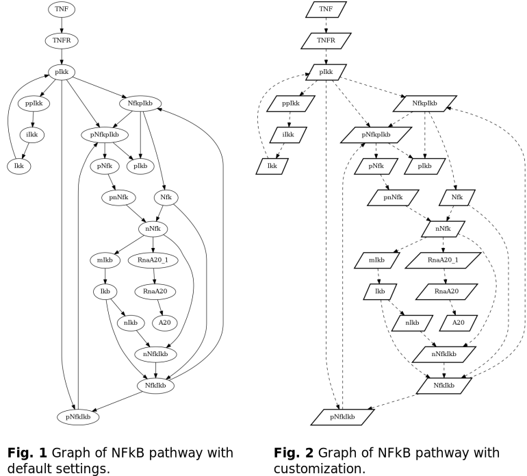

Graph visualization
===================

This tutorial will show you how to turn your computational model into a graph and generate both static and dynamic images from it.  
For demonstration purposes we will use the `nfkb_pathway <https://github.com/biomass-dev/biomass/tree/master/biomass/models/nfkb_pathway>`_ model included in biomass. For a detailed description of the model, please refer to the following paper:  

* Oppelt, A. *et al*. Model-based identification of TNFα-induced IKKβ-mediated and IκBα-mediated regulation of NFκB signal transduction as a tool to quantify the impact of drug-induced liver injury compounds. *npj Syst. Biol. Appl.* **4**, 23 (2018). https://doi.org/10.1038/s41540-018-0058-z

Requirements
------------
* ``biomass>=0.9.0``
* ``graphviz>=2.42`` Installation instructions can be found `here <https://graphviz.org/download/>`_

Import the model
^^^^^^^^^^^^^^^^^^^^
.. code-block:: python

    import biomass
    from biomass import create_model
    
    model = create_model('biomass.models.nfkb_pathway')

Graph generation and static image
^^^^^^^^^^^^^^^^^^^^^^^^^^^^^^^^^^
The graph is extracted from the equations contained in ``ode.py`` and ``reaction_network.py``. If flux equations are not provided it is assumed that you directly declare them in ``ode.py``. Otherwise the individual fluxes are associated with their participating species, and the fluxes in turn are associated with the species in the differential equations in ode.py.  

.. code-block:: python

    model.to_graph()
    model.graph
    
The graph property contains an instance of the AGraph class implemented by pygraphviz. For available methods please refer to `their documentation <https://pygraphviz.github.io/documentation/stable/reference/agraph.html>`_. You can for example manually add/remove nodes or save the graph into a .dot file and import it into another 3rd party software.

A static image of the graph is drawn using

.. code-block:: python

    model.static_plot(save_dir='example_dir', file_name='nfkb_static.png')
    model.static_plot(save_dir='example_dir', file_name='nfkb_static_cust.png',\
                      gviz_args='-Nshape=parallelogram -Nstyle=bold -Estyle=dashed')
    
The desired file format is inferred from the ending of file_name. Graphviz provides a variety of different engines that automatically generate a layout for the graph. By default the 'dot' engine is used, since it uses a hierarchical approach that is natural for biological data. Feel free to play around with the available engines, but be aware that biological networks can quickly become messy due to the prevalance of feedback interactions.  
Additionally graphviz provides a large variety of customization options, that have to be passed in the command line format. For a comprehensive list see the `graphviz manual <https://graphviz.org/pdf/dot.1.pdf>`_.  

Dynamic image
^^^^^^^^^^^^^^^
Thanks to the package pyvis we can also provide an interactive graph. The generation is just as simple as for the static image:  

.. code-block:: python

    model.dynamic_plot(save_dir='example_dir', file_name='nfkb_dynamic.html' show_controls='True', which_controls=['physics', 'layout'])
    
By default the plot will be immediately displayed in your browser. Set show to False if you don't want that. pyvis provides a variety of customization options as well. They can be directly accessed in the html file by setting show_controls to True. You can also specify which controls you want.

.. raw:: html
    :file: dynamic_nfkb_graph.html
