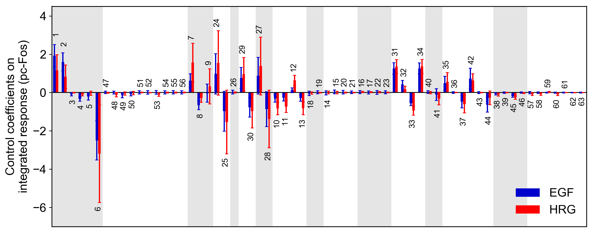

## Sensitivity Analysis
The single parameter sensitivity of each reaction is defined by<br>

*s<sub>i</sub>*(*q*(**v**),*v<sub>i</sub>*) = *∂* ln(*q*(**v**)) / *∂* ln(*v<sub>i</sub>*) = *∂*_q_(**v**) / *∂*_v<sub>i</sub>_ · *v<sub>i</sub>* / *q*(**v**)

where *v<sub>i</sub>* is the *i*<sup>th</sup> reaction rate, **v** is reaction vector **v** = (*v<sub>1</sub>*, *v<sub>2</sub>*, ...) and *q*(**v**) is a target function, e.g., time-integrated response, duration. Sensitivity coefficients were calculated using finite difference approximations with 1% changes in the reaction rates.

```python
from biomass import run_analysis

run_analysis(Nakakuki_Cell_2010, target='reaction', metric='integral', style='barplot')
```

**target** : str
- ```'reaction'```
- ```'initial_condition'```
- ```'parameter'```

**metric** : str
- ```'maximum'```
    : The maximum value.
- ```'minimum'```
    : The minimum value.
- ```'duration'```
    : The time it takes to decline below 10% of its maximum.
- ```'integral'```
    : The integral of concentration over the observation time.

**style** : str
- ```'barplot'```
- ```'heatmap'```



Control coefficients for integrated pc-Fos are shown by bars (blue, EGF; red, HRG). Numbers above bars indicate the reaction indices, and error bars correspond to simulation standard deviation.