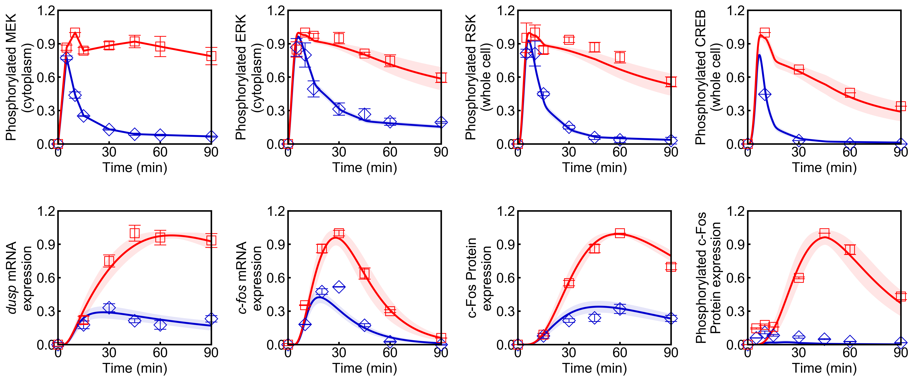

## Visualization of Simulation Results
```python
from biomass import run_simulation

run_simulation(Nakakuki_Cell_2010, viz_type='average', show_all=False, stdev=True)
```
**viz_type** : str

- ```'average'```
    : The average of simulation results with parameter sets in ```out/```.

- ```'best'```
    : The best simulation result in ```out/```, simulation with ```best_fit_param```.

- ```'original'```
    : Simulation with the default parameters and initial values defined in ```set_model.py```.

- ```'n(=1,2,...)'```
    : Use the parameter set in ```out/n/```.
    
- ```'experiment'```
    : Draw the experimental data written in ```observable.py``` without simulation results.    

**show_all** : bool
- Whether to show all simulation results.

**stdev** : bool
- If True, the standard deviation of simulated values will be shown (only when ```viz_type == 'average'```).




Points (blue diamonds, EGF; red squares, HRG) denote experimental data, solid lines denote simulations
